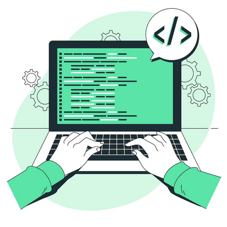

# 👋 Hello, I'm Henrique Lima!

### Jappa.dev 🚀

**Systems Analysis and Development Student | Python Developer | Automation Enthusiast**

---

## 👨‍💻 About me

Hello! I'm Henrique Lima, also known as **Jappa**.

I'm a Systems Analysis and Development student passionate about technology, software development and process automation.

I have professional experience in **Occupational Safety (SST)** and I'm combining this knowledge with programming to create solutions that improve processes, organize information and solve real-world problems.

Currently focused on:

* 🐍 Python development
* 🗄️ SQL and database management
* ⚙️ Process automation
* 💻 Software development
* 📊 Data organization and analysis

My goal is to build efficient systems that connect technology with business needs.

---

## 🚀 Featured Projects

### 🤖 SSMA Bot

Automation project focused on Occupational Safety management.

A solution designed to help control information such as:

* Employee data
* Training expiration dates
* NR compliance
* PPE management
* Automated queries and alerts

**Technologies:**

`Python` `SQLite` `Telegram API` `Excel Integration`

---

### 🦺 EPI Management System

System concept for managing Personal Protective Equipment according to NR-06 requirements.

Features:

* Employee registration
* PPE delivery control
* Expiration monitoring
* Reports and dashboards

**Technologies:**

`Python` `Database` `Excel Automation`

---

## 🛠️ Technologies & Tools

---

## 📚 Currently learning

* Software Engineering
* Backend Development
* Database Design
* API Integration
* System Architecture

---

## 📊 GitHub Stats

---

## 📫 Contact

---

### "Building solutions through technology and continuous learning 🚀"

